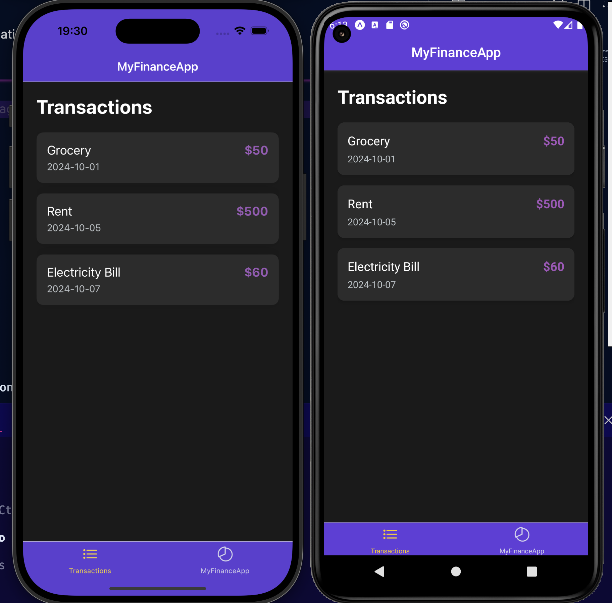
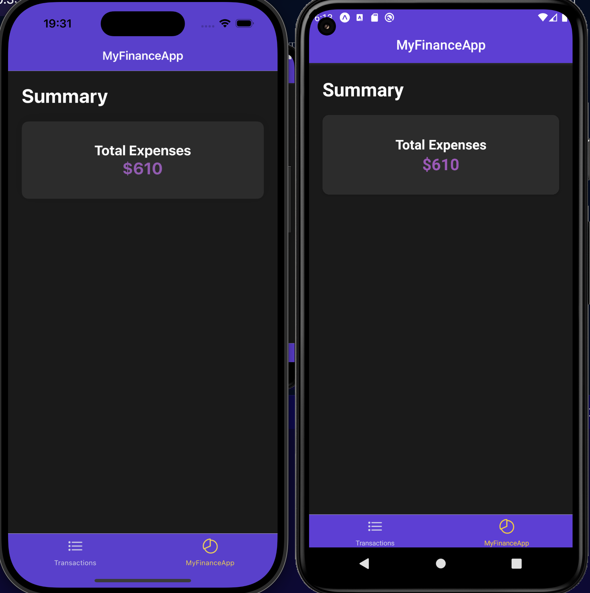

---

# MyFinanceApp
A sleek and intuitive financial tracking app built with React Native. It helps users manage their expenses effectively with a clean, dark purple-themed UI. This app allows you to view transactions, track total expenses, and navigate through different financial details seamlessly.

✨ **Features**
- 💰 **Transaction Management**: View a list of your financial transactions with amounts, dates, and details.
- 📊 **Summary**: A summary screen that displays the total of all expenses.
- 🌈 **Dark & Purple UI**: Beautiful dark mode interface with purple accents for a modern, eye-catching design.
- 🛠️ **Smooth Navigation**: Easy-to-use navigation with stack and tab navigators for a seamless user experience.

🛠️ **Technologies Used**
- **React Native**: A JavaScript framework for building native mobile apps.
- **Expo**: A platform for universal React applications.
- **React Navigation**: For smooth stack and tab-based navigation between screens.
- **Custom Styling**: For a modern, dark theme with purple highlights.

📸 **Screenshots**

- **Transactions Screen**  
  

- **Summary Screen**  
  


🚀 **Getting Started**
Follow these steps to get the project up and running locally.

### **Prerequisites**
- **Node.js**: Recommended version >= 16.0.
- **npm** or **Yarn**: Node package managers.
- **Expo CLI**: Run the following command to install:
  ```bash
  npm install -g expo-cli
  ```

### **Installation**

1. **Clone the repository**:
   ```bash
   git clone https://github.com/Qusai007/FinancialApp.git
   ```

2. **Navigate to the project directory**:
   ```bash
   cd FinancialApp
   ```

3. **Install dependencies**:

   - Using npm:
     ```bash
     npm install
     ```

   - Or using Yarn:
     ```bash
     yarn install
     ```

### **Running the App**
To run the app in the development environment:

1. **Start Expo**:
   ```bash
   npx expo start
   ```

2. **Run on Emulator or Device**:
   - You can use the Expo Go app to scan the QR code for running it on your physical device.
   - Alternatively, run on an Android/iOS simulator through the Expo Developer Tools.

📂 **Project Structure**

```
.
├── assets                  # Images and media files
├── navigation              # Contains navigation setup (TabNavigator, StackNavigator)
├── screens                 # All screen components (TransactionListScreen, SummaryScreen, etc.)
├── App.js                  # Main application entry point
├── package.json            # Dependencies and project scripts
├── .expo                   # Expo configuration files
└── README.md               # Project documentation
```

🤝 **Contributing**
Contributions are welcome! Please follow these steps:

1. Fork the repository.
2. Create a new branch (`feature-name`).
3. Commit your changes (`git commit -m "Add some feature"`).
4. Push to the branch (`git push origin feature-name`).
5. Open a pull request.

📄 **License**
This project is licensed under the MIT License.

💬 **Connect**
- **GitHub**: [@Qusai007](https://github.com/Qusai007)
- **LinkedIn**: [Qusai Johar](https://www.linkedin.com/in/qusai-johar/)

Feel free to share your feedback, ideas, or report bugs!

---

🚀 **Quick Commands**:
| Task                     | Command                     |
|--------------------------|-----------------------------|
| Clone Repository          | `git clone <repo-url>`      |
| Install Dependencies      | `npm install` or `yarn`     |
| Start Development Server  | `expo start`                |
| Lint the Code             | `npm run lint` (optional)   |

Enjoy managing your finances with a clean and modern app! 🎉

---# Sem3AdvTopics_Lab2
